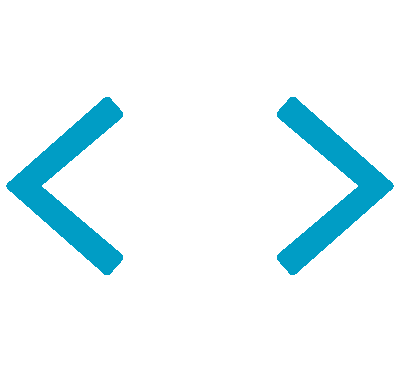

<h1></h1>

<h1 align="center">
  Hi, I'm
  <a href="https://github.com/AdamantiumCode">AdamantiumCode</a>
  
</h1>

<h3 align="center">
  <q>A good programmer is someone who always looks both ways before crossing a one-way street.</q> 
  <b> — Doug Linder </b>
</h3>

<h1></h1>

  

<h1></h1>

<h1 align="center">
  About me
  
</h1>

<h3>
  I'm a Junior ML Engineer and a great guy :sunglasses:
</h3>

<h3>
  <ul>
    <li> I'm developing neural networks, bots and various apps :brain: </li> 
    <li> I learn quickly and I'm not afraid to take the initiative :muscle: </li> 
    <li> I'm looking for projects to collaborate on :busts_in_silhouette: </li> 
    <li> In my free time I read scientific articles :computer: </li> 
    <li> And I also love cats :smirk_cat: </li>
  </ul>
</h3>

<h1></h1>

<h1 align="center">
  Languages and Tools
  
</h1>

  
  
  
   
  
  
  
   
  
  
   
  
  
  

<h1></h1>

<h1 align="center">
  My social networks
  
</h1>

  
  
  
  

<h1></h1>

<h1 align="center">
  My Stats
  
</h1>

<h1 align="center">
   
  
</h1>
